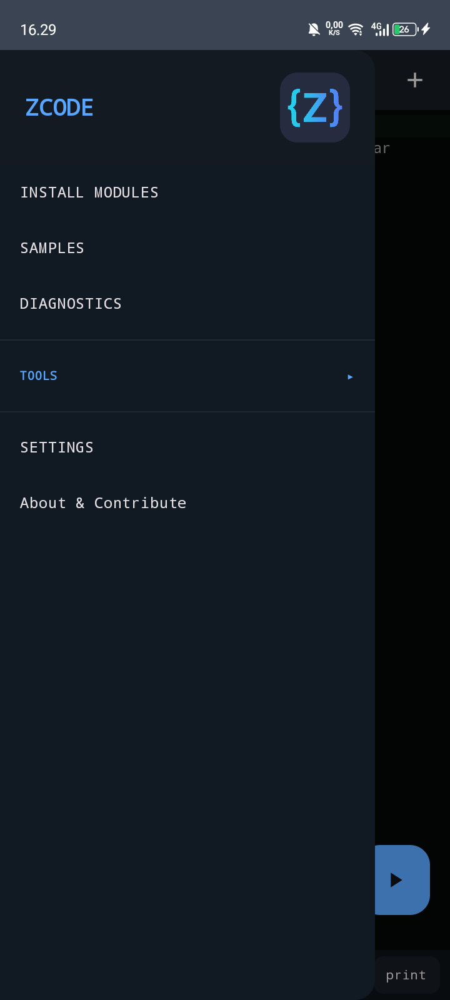
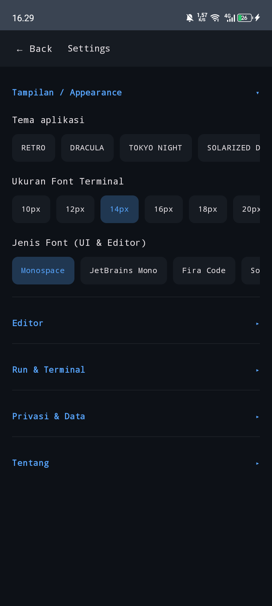
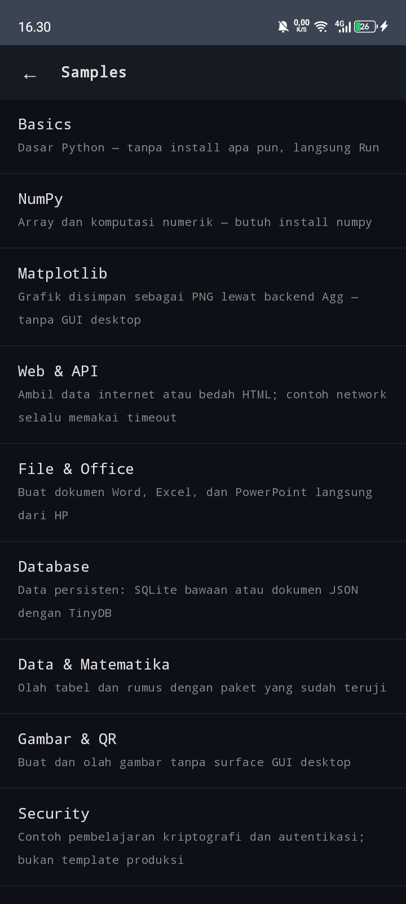
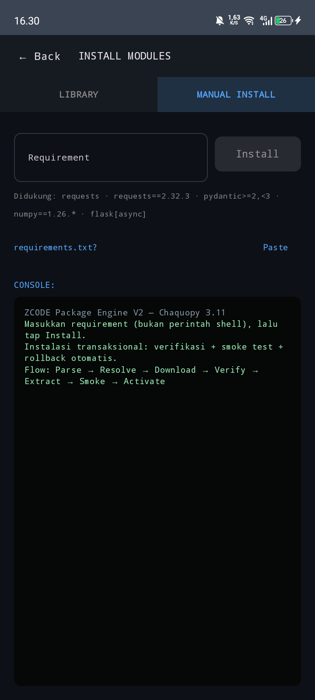
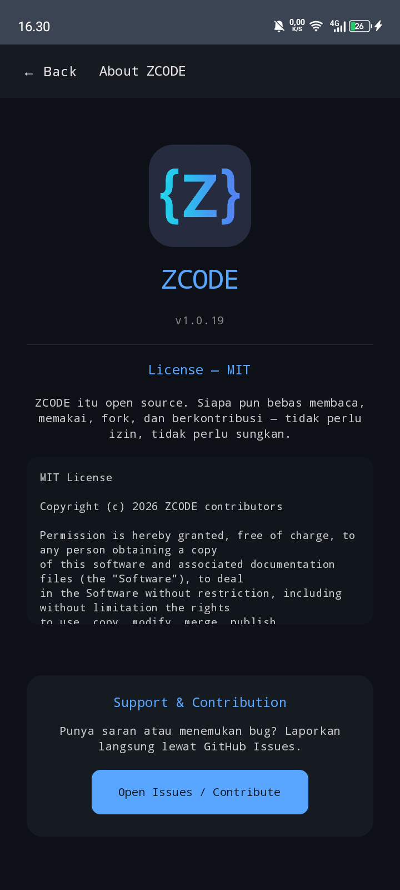
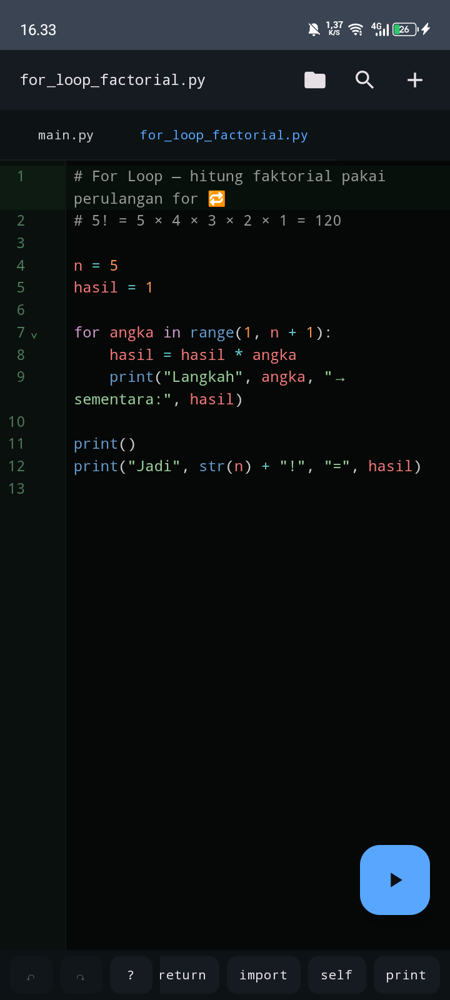
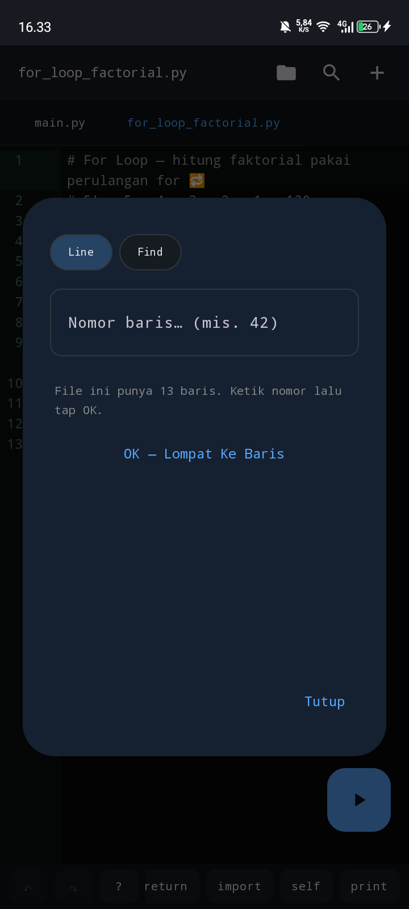
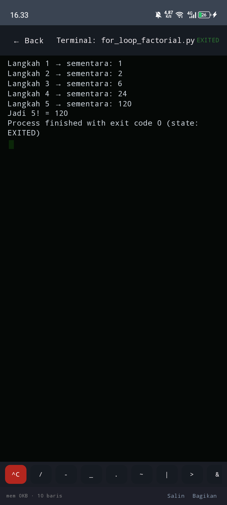

<div align="center">
  
  <h1>ZCODE</h1>
  <p><strong>IDE Python Android yang gratis, offline-first, dan menjadikan ARMv7/HP terbatas sebagai target kelas satu.</strong></p>
  <p><em>Bukan tentang punya perangkat terbaik. Tentang tetap bisa berkarya dengan perangkat yang kita punya.</em></p>

  <p>
    <a href="https://github.com/muzape28-blip/ZCODE/actions/workflows/build.yml"></a>
    <a href="LICENSE"></a>
    
    
    
    
  </p>
</div>

---

## Apa itu ZCODE?

ZCODE adalah IDE Python untuk Android yang dirancang agar seseorang dapat
**menulis, menjalankan, memahami, memperbaiki, menyimpan, dan membagikan project
Python tanpa PC**.

Pusat produknya bukan jumlah menu atau kemiripan dengan editor desktop, tetapi
satu alur yang utuh:

```text
Editor → Run/Input → Terminal → Package Engine → Library/Samples → Diagnostics
```

Pembanding produk terdekatnya adalah Pydroid. VS Code dan Acode dipelajari
sebagai sumber pola editor, workbench, terminal, dan arsitektur plugin—bukan
fitur yang harus disalin semuanya. Lihat
[`RISET_VSCODE_ACODE_PYDROID_2026_08_19.md`](docs/RISET_VSCODE_ACODE_PYDROID_2026_08_19.md).

### Empat komitmen

1. **Gratis, tanpa premium lock.** Fitur yang didukung tersedia untuk semua.
2. **Offline-first, bukan offline-only.** Editor dan runtime bekerja offline;
   script tetap boleh memakai internet.
3. **ARMv7 kelas satu.** HP murah bukan warga kelas dua.
4. **Keterbatasan bukan jalan buntu.** Yang belum didukung dijelaskan dengan
   jujur, diberi alternatif, dan dapat menjadi target riset tanpa janji palsu.

---

## Tampilan di perangkat nyata

Screenshot berikut berasal dari perangkat runtime **INFINIX X6532C, Android
14 / API 34, userspace ARMv7 (`armeabi-v7a`)**, bukan mockup.

<table>
  <tr>
    <td align="center"><br/><sub>Splash</sub></td>
    <td align="center"><br/><sub>Drawer</sub></td>
    <td align="center"><br/><sub>Settings</sub></td>
  </tr>
  <tr>
    <td align="center"><br/><sub>Samples</sub></td>
    <td align="center"><br/><sub>Library</sub></td>
    <td align="center"><br/><sub>Manual Install</sub></td>
  </tr>
  <tr>
    <td align="center"><br/><sub>Editor</sub></td>
    <td align="center"><br/><sub>Line &amp; Find</sub></td>
    <td align="center"><br/><sub>Terminal</sub></td>
  </tr>
</table>

---

## Kemampuan utama

### Editor mobile yang benar-benar offline

- **CodeMirror 6** dan parser Python Lezer dibundel di APK—tanpa CDN.
- Syntax highlight, line number, fold gutter, bracket matching, Find, dan
  autocomplete offline.
- Lint gutter dan whitespace guard dari pemeriksa ZCODE.
- Multi-file tabs dengan autosave dan pemulihan workspace.
- **Undo/Redo touch dengan history terpisah per file**; pindah tab tidak
  mencampur isi/history.
- Reference Card, symbol bar, dan tombol Run yang ramah jempol.
- Go to line dan Find dalam palette.
- Traceback terminal dapat ditap untuk kembali ke baris sumber.
- Font offline: Monospace, JetBrains Mono, Fira Code, dan Source Code Pro.

### File dan workspace

- File internal tersimpan otomatis.
- Open/Save/Save as melalui Android Storage Access Framework.
- Import text dengan validasi ukuran, binary, UTF-8, nama file, dan traversal.
- Rename/delete dari judul file; tab aktif dan daftar tab dipersist.
- Project multi-file Python dapat saling import dalam workspace.

### Python 3.11 di Android

- Python 3.11 melalui **Chaquopy 17.0.0**.
- ABI APK: `armeabi-v7a`, `arm64-v8a`, dan `x86_64`.
- `print()`, `input()`, file I/O, network, import antar-file, dan package user.
- Terminal full-screen dengan output realtime dan input langsung.
- `^C` deterministik saat script menunggu `input()`; penghentian CPU/native loop
  masih memiliki batas in-process yang dijelaskan di bawah.
- Working directory script adalah workspace ZCODE.

### Install Modules yang transaksional

ZCODE tidak sekadar menjalankan `pip install` lalu menganggap sukses.

```text
Parse → Resolve → Storage Guard → Download → Verify → Extract
→ Native Dependency Scan → Smoke Test → Activate → Rollback bila gagal
```

- Requirement PEP 508, extras, version pin, dan antrean `requirements.txt`.
- Sumber PyPI dan indeks wheel Android Chaquopy.
- Penolakan wheel platform yang tidak cocok (`glibc` bukan Android `bionic`).
- Tested-version pin, dependency transitif, cache, progress, dan cancel
  kooperatif.
- Smoke test sebelum package diaktifkan.
- Rollback menjaga environment lama ketika instalasi gagal.
- Log semantic yang dapat disalin: `[>]`, `[INFO]`, `[WARN]`, `[WAIT]`, `[OK]`,
  `[ERR]`, dan `[STOP]`.
- Uninstall meminta konfirmasi dan menjelaskan bahwa reverse-dependency graph
  belum tersedia; ZCODE tidak auto-clean dependency secara sembarangan.
- Setelah package native dimuat/diubah, ZCODE menyimpan workspace lalu
  **relaunch otomatis** ke process Python yang bersih. Jika dipilih `Nanti`,
  banner tetap terlihat dan Run/package mutation dikunci sampai restart.
- Transisi relaunch memakai Binary Rain ringan: trail vertikal hanya mengulang
  binary ASCII `ZCODE`, tanpa Python, dependency tambahan, atau delay palsu.

### Library dan Samples

- **342 kartu package** pada snapshot v1.0.19.
- **230 package berstatus TESTED** pada perangkat/lingkungan yang tercatat.
- Status dibedakan: TESTED, COMPATIBLE, EXPERIMENTAL, INCOMPATIBLE, UNAVAILABLE.
- Detail package menjelaskan What/Why/How/Where/Who, versi, dependency, risiko,
  sumber, dan batas perangkat.
- Tombol **Coba contoh lengkap** menghubungkan kartu package ke Samples.
- **37 sample runnable dalam 11 kategori**: Basics, NumPy, Matplotlib, Web & API,
  File & Office, Database, Data & Matematika, Gambar & QR, Security, Utilities,
  dan Project Mini.
- Sample package memeriksa dependency sebelum file dibuat dan menawarkan
  `Install dulu`, `Buka kode`, atau `Batal`.

### Diagnostics tanpa PC

- Breadcrumb untuk Run, editor, traceback, package resolve/install/uninstall,
  file, dan lifecycle penting.
- Crash report dan run log dapat dibaca/disalin dari aplikasi.
- Output teknis tidak disembunyikan ketika user hanya memiliki HP.
- Status pekerjaan dibedakan secara jujur: designed, implemented, CI verified,
  device verified, dan released.

---

## Quick start

1. Buka ZCODE dan edit `main.py`, atau tap `+` untuk file baru.
2. Tap tombol biru **Run**.
3. Lihat output dan jawab `input()` langsung di terminal.
4. Untuk package tambahan, buka **INSTALL MODULES**:
   - **Library** untuk package terkurasi;
   - **Manual Install** untuk requirement spesifik.
5. Buka **Samples** untuk membuat contoh runnable ke workspace.
6. Jika terjadi masalah, buka **Diagnostics** dan salin detailnya.

Contoh sederhana:

```python
import urllib.request

with urllib.request.urlopen("https://httpbin.org/get", timeout=10) as response:
    print(response.status)
```

Python network tetap bekerja; pembatasan network yang ketat hanya berlaku pada
WebView editor lokal.

---

## Status verifikasi v1.0.19

ZCODE menggunakan label bukti, bukan satu kata “done”.

| Lapisan | Status |
|---|---|
| Unit/structural/mutation tests | 593 lulus pada snapshot dokumentasi ini |
| Kotlin lexical sanity | 61 file |
| GitHub Actions check + APK build | Gerbang canonical; native-rebirth terbaru belum CI VERIFIED |
| Editor security, focus topology, glyph, traceback, Undo/Redo | DEVICE VERIFIED di Infinix ARMv7 |
| Package Engine core dan ratusan package | DEVICE VERIFIED bertahap; detail ada di katalog/docs |
| Semantic package logs + uninstall hardening | IMPLEMENTED; visual/copy + `Batal` menunggu UAT final |
| Native-runtime rebirth + Binary Rain | IMPLEMENTED + LOCALLY VERIFIED; belum CI/DEVICE VERIFIED |
| Release v1.0.19 | Belum—branch fondasi belum di-merge ke `main` |

Laporan eksekusi terbaru:
[`docs/RENCANA_V1019.md`](docs/RENCANA_V1019.md).

---

## Batas yang sengaja dikatakan terang-terangan

- **Python tetap 3.11.** Chaquopy berhenti menyediakan wheel native 32-bit pada
  Python 3.12+, sehingga upgrade akan mengorbankan NumPy/ARMv7.
- Python user berjalan **in-process**. `while True: pass` atau native call yang
  macet belum selalu dapat dibunuh tanpa mematikan process aplikasi.
- ZCODE belum memiliki Linux shell, compiler native, Git penuh, atau Alpine
  terintegrasi.
- SciPy/scikit-learn tidak tersedia untuk CPython 3.11 ARMv7 melalui indeks
  Chaquopy saat ini.
- Kivy, Tkinter, Qt/PySide, Pygame, TensorFlow, PyTorch, dan OpenCV bukan sekadar
  masalah RAM; mereka membutuhkan binary/surface/runtime yang belum dimiliki
  ZCODE.
- Uninstall belum memiliki reverse-dependency ownership graph.
- Bukti perangkat utama saat ini berasal dari satu Infinix ARMv7; ini bukan
  klaim universal untuk seluruh ROM/WebView Android.
- CSP editor melindungi editor JavaScript, **bukan** mengisolasi script Python
  yang sengaja dijalankan user.

Roadmap tidak mengubur keterbatasan tersebut. ZCODE mencatat alasan, alternatif,
dan premis yang dapat membuka riset kembali.

---

## Arsitektur singkat

```text
Jetpack Compose UI
├── Workbench / Settings / Library / Samples / Diagnostics
├── CodeMirror 6 dalam WebView file:// yang local-only
├── WorkspaceViewModel + FileManager
├── ExecutionEngine + Chaquopy Python 3.11
├── NativeRuntimeState + private :rebirth process handoff
├── Package Engine V2
│   ├── RequirementParser / DependencyResolver
│   ├── Verifier / SmokeTestRunner / TransactionManager
│   └── PackageDb / TelemetryStore / semantic logs
└── Local assets: editor bundle, fonts, catalog, samples, Python runtime helpers
```

Editor WebView, Python networking, dan target App Mode adalah tiga trust/runtime
layer berbeda. Detail security dan arah terminal tersedia di dokumentasi.

---

## Build dan test

### Local checks

```bash
bash tools/check.sh
```

Check ini menjalankan guard editor offline, supply-chain npm, Kotlin lexical
sanity, security invariants, dan seluruh pytest utama.

### Build APK

Butuh JDK 17, Android SDK 34, Gradle 8.5, dan Python 3.11 untuk buildPython
Chaquopy:

```bash
gradle assembleDebug
```

GitHub Actions adalah hakim kompilasi/build canonical proyek.

### Regenerasi CodeMirror bundle

```bash
cd editor-src
npm ci
npm run build
```

Bundle hasil build harus di-commit karena editor APK tetap offline-first.

---

## Roadmap setelah v1.0.19

Roadmap mengikuti kebutuhan karya nyata, bukan perlombaan jumlah fitur.

1. Project backup/export/import dan recovery yang semakin kuat.
2. Project model yang lebih jelas (`main.py`, data, output, requirements).
3. Test runner dan debugger Python bertahap.
4. Private-process Python untuk hard-stop dan crash isolation.
5. Command Console / Python REPL.
6. App Mode dengan Preview WebView terpisah dan loopback aman.
7. Code intelligence berbasis provider/Jedi/LSP.
8. Git ringan.
9. Alpine/PRoot **opt-in** hanya bila shell/compiler/SciPy benar-benar dibutuhkan.
10. Plugin API eksternal hanya setelah permission, lifecycle, update, dan crash
    isolation memiliki kontrak yang kuat.

Target terminal/interpreter:
[`docs/TARGET_TERMINAL_ZCODE.md`](docs/TARGET_TERMINAL_ZCODE.md).

---

## Peta dokumentasi

| Dokumen | Isi |
|---|---|
| [`PRD_ZCODE.md`](docs/PRD_ZCODE.md) | Misi, prinsip, arsitektur, roadmap, batas |
| [`RENCANA_V1019.md`](docs/RENCANA_V1019.md) | Log implementasi dan bukti UAT v1.0.19 |
| [`RENCANA_UPDATE_2026_08.md`](docs/RENCANA_UPDATE_2026_08.md) | Keputusan redesign dan arah App Mode/ZPLAY |
| [`SKILLS.md`](docs/SKILLS.md) | Playbook engineering khusus ZCODE |
| [`AGENTS.md`](AGENTS.md) | Operating agreement universal untuk coding agent |
| [`AUDIT_LIBRARY_SAMPLES_V1019.md`](docs/AUDIT_LIBRARY_SAMPLES_V1019.md) | Audit Library dan Samples |
| [`SPEC-001_IMPLEMENTATION_2026_08.md`](docs/SPEC-001_IMPLEMENTATION_2026_08.md) | Package/terminal reliability platform |
| [`MIGRASI_CM6.md`](docs/MIGRASI_CM6.md) | Migrasi dan kontrak CodeMirror 6 |
| [`RISET_VSCODE_ACODE_PYDROID_2026_08_19.md`](docs/RISET_VSCODE_ACODE_PYDROID_2026_08_19.md) | Posisi produk dan pelajaran pembanding |

---

## Kontribusi dan feedback

- Bug/saran: [GitHub Issues](https://github.com/muzape28-blip/ZCODE/issues)
- Source dan fork dipersilakan sesuai lisensi MIT.
- Jangan memasukkan secret, token, atau data pribadi ke issue/log.
- Kontribusi package wajib menyebut versi, Python, Android/ABI, sumber wheel, dan
  tingkat verifikasinya.

## Lisensi

ZCODE dirilis di bawah [MIT License](LICENSE).

Font JetBrains Mono, Fira Code, dan Source Code Pro memakai SIL Open Font License
1.1; teks lisensi tersedia bersama asset font.

---

<div align="center">
  <strong>ZCODE</strong><br/>
  <em>Tetap bisa berkarya dengan perangkat yang kita punya.</em>
</div>
