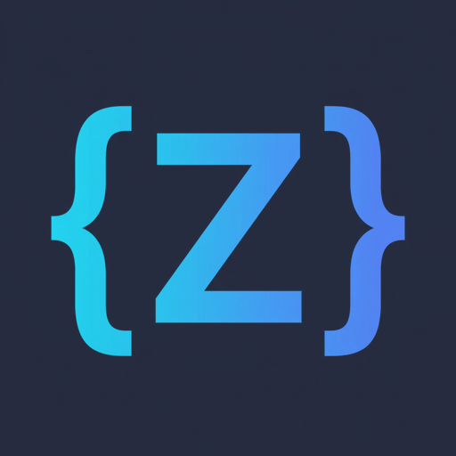
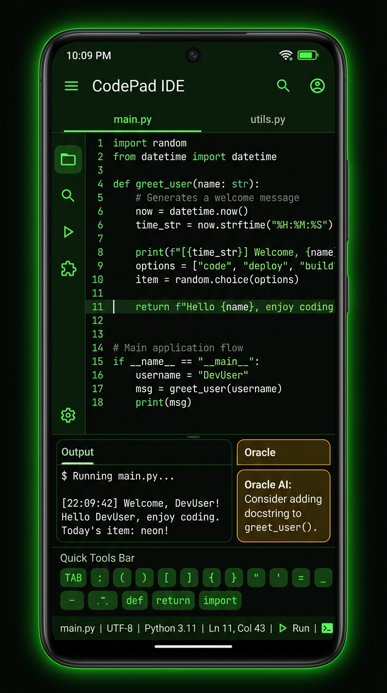

<div align="center">
  
  <h1>ZCODE — Zabacode Kotlin Edition</h1>
  <p><em>Editor Python mobile, offline-first, true-black OLED — untuk HP kentang sekalipun.</em></p>

  <p>
    <a href="https://github.com/muzape28-blip/ZCODE/actions/workflows/build.yml"></a>
    <a href="LICENSE"></a>
    
    
    
    
    
  </p>
</div>

**Filosofi:** *full free, tanpa premium lock* — untuk pelajar, pemburu hobi coding, dan developer dengan perangkat terbatas & budget tipis. Semua fitur bebas dipakai siapa saja, offline-first, dan sebisanya tetap ringan di HP kentang. 💚

Menggabungkan **kesederhanaan Pydroid**, **detail arsitektur VS Code**, dan **optimasi touch Acode** menjadi editor Python mobile offline-first dengan true-black OLED. Referensi proyek: [muzape28-blip/ZABACODE](https://github.com/muzape28-blip/ZABACODE).

---

## 📸 Tampilan

<div align="center">
  
</div>

> Mockup desain tema Retro (phosphor green di atas OLED). 10 tema tersedia:
> Retro, Dracula, Tokyo Night, Solarized Dark, Monokai, Nord, One Dark,
> Gruvbox Dark, GitHub Dark, Cobalt2 — editor & terminal tetap true-black `#050806`.

---

## 🚀 Fitur yang Sudah Dibangun

### 🎨 1. Desain Total & Estetika

- **True-Black OLED (`#050806`)** — ruang editor dan terminal output selalu hitam legam, hemat baterai AMOLED dan nyaman untuk begadang. Warna ini **tidak berubah** walau tema diganti.
- **10 Tema Sinkron** — tema menyentuh bagian dekoratif (topbar, drawer, dialog, tombol) secara harmonis; pembatas visual dibuat soft (opacity rendah), bukan garis tegas.
- **Drawer swipe-only (audit 2026-08)** — sidebar dibuka dengan swipe dari pinggir kiri; topbar bersih tanpa ikon menu. Tip swipe tertera di `main.py` bawaan.
- **Jenis font pilihan (audit 2026-08)** — Monospace device, **JetBrains Mono, Fira Code, Source Code Pro** (dibundel offline, lisensi SIL OFL) berlaku untuk UI + editor; **ukuran font terminal** bisa diatur terpisah di Settings; editor fix 14px.
- **Tab Bar Multi-File** — hanya muncul bila ≥ 2 tab (tidak menuhin editor); long-press/hold tab untuk menutup file (tanpa tombol × yang rawan salah pencet).
- **QuickTools & FAB ▶** — chips (`Tab`, `:`, `;`, `'`, `#`, `(`, `)`, `[`, `]`, `def`, `return`, `import`) di bawah editor (bisa dimatikan via drawer), FAB Run melayang di atasnya.
- **Topbar** — nama file (tap → dialog Rename/Delete), ikon folder → menu file **Open / Save / Save as**, kaca pembesar (palette Line & Find), plus (file baru). Semua ikon **vektor polos ber-tint mengikuti tema** (bukan emoji — seragam di semua merk HP).
- **Keyboard cerdas (audit 2026-08)** — keyboard editor hanya muncul saat tap terkonfirmasi; swipe buka drawer / scroll tidak lagi memunculkan keyboard.

### 📁 2. File Manager, Menu File & Persistensi Workspace

- **CRUD penuh** di `filesDir/` internal (anti `files/files` double nesting, `secure_filename`, `MAX_FILE_BYTES` 512KB, `MAX_FILENAME_LEN` 128, anti traversal).
- **Menu file di topbar (audit 2026-08)** — *Open* (import dari file manager HP via SAF, salin ke workspace), *Save* (timpa file asli di device — izin tulis SAF persisten), *Save as* (file device baru via SAF, lalu di-link untuk Save berikutnya). File internal tersimpan otomatis.
- **Frictionless creation** — tap `+` langsung membuat `untitled_N.py`; ganti nama belakangan via tap judul.
- **Import aman** — cap 512KB, deteksi biner (NUL byte) & encoding non-UTF-8 (U+FFFD) dengan pesan ramah, nama bentrok dapat suffix unik.
- **Workspace Recovery** — isi file tersimpan otomatis tiap perubahan + daftar tab & file aktif dipersist, sehingga alur kerja pulih walau aplikasi ditutup paksa / di-swipe dari Recent Apps.

### 💻 3. Terminal Interaktif Full-Screen (Python di HP — Chaquopy 3.11)

- **Runtime Python di-embed (Chaquopy 3.11)** — APK membawa interpreter Python arm64 + armeabi-v7a, jadi `▶ Run` & `input()` **benar-benar berjalan di HP ARMv7** (dual-backend: Chaquopy in-process di Android, `python3` subprocess untuk dev/desktop).
- **Pindah layer** — `▶` membuka terminal full-screen (bukan panel); `◀ Back` di pojok kiri atas kembali ke editor.
- **Ketik langsung** — sentuh terminal untuk memunculkan keyboard; Enter mengirim baris ke stdin (tanpa kotak stdin / tombol Send). `input()` di script langsung berfungsi.
- **Ctrl+C** — tombol merah di toolbar bawah: deterministik untuk script yang nge-blok di `input()` (KeyboardInterrupt), best-effort interrupt thread worker untuk loop CPU.
- **Guard output** — ring buffer dapat diatur (64KB / 256KB / 1MB), cap antrian input 10k; proses dibersihkan saat keluar terminal.
- **cwd = folder workspace** — `plt.savefig("out.png")` / `open("data.txt")` relatif bekerja seperti di desktop.

### 📦 4. Pip Package Manager Layer

- **Real-time log streaming** — `Drawer → INSTALL MODULES` → ketik nama package → log unduhan/instalasi/traceback mengalir langsung (pip in-process Chaquopy di Android, pip 23.3.1 dibundel build-time).
- **Guard** — validasi nama package (anti shell injection) + cap log.

### 🔍 5. Command Palette & Quick Open

- Tombol kaca pembesar di topbar (akses jempol, tanpa keyboard fisik).
- Ketik nama file → Quick Open; awali dengan `>` → perintah (plugin transforms, Pip, About); chips `[Line][Find]` → Go to Line ber-validasi & Find dengan hasil `L<n>:` yang bisa di-tap.

### ⚡ 6. Real-time Syntax Diagnostic + Visual Problems Panel

- Scanner offline single-pass: strip komentar & string (aman untuk `print(' :)')`), deteksi string tak tertutup, keseimbangan `() [] {}` dengan nomor baris.
- Debounce 800ms + pembatalan job lama → tanpa race, UI tetap 60fps.
- **VPP** — banner daftar masalah yang bisa di-expand in-place; tap item → lompat ke baris.

### 🔧 7. Plugin Transformasi Kode

- **Beautifier Pro** — spasi operator rapi dengan prioritas longest-first (`->`, `**`, `//=`, `<<`, ...); string & komentar tidak pernah disentuh; unary (`-1`, `*args`, `~x`) & unpacking (`**kwargs`) aman.
- **Optimize Auto-Imports**, **Smart Docstring Generator**, **Type Hint Generator**, **Find Duplicate Lines** (port ZABACODE, GPLv3 same-author), **Duplicate Active Line**, **Toggle Line Comment**, **TODO Extractor** (tap → lompat), **Snippet Pack** (Flask/BS4/AsyncIO/REST).
- Semua plugin toggle-able di drawer TOOLS, persist SharedPreferences satu sumber kebenaran.

### 🧩 Editor

- **CodeMirror 6 bundled offline** (migrasi penuh dari Ace 1.44.0, 2026-08 — `docs/MIGRASI_CM6.md`; tanpa CDN, single-file bundle esbuild target es2018, armv7/arm64/x86_64 aman) di WebView `file://` — font fix 14px, gutter line numbers, tema tomorrow-night-eighties deklaratif di atas OLED, Python syntax via Lezer parser, autocomplete kasta 1+2, panel Find built-in. Sumber bundle: `editor-src/` (`npm ci && node build.mjs`).
- **Bridge `addJavascriptInterface`** — tanpa loopback HTTP (kelas bug F-01/S-27/C-50 dari Zabacode terhapus).
- **Bridge pengaturan live** — `setCloseBrackets`, `setHighlightSelectionMatches`, `setFontFamily` via Compartment (reconfigure tanpa recreate editor — anti jank di HP kentang).

### 🥚 8. Rahasia Kecil

> Psst… ada yang bilang logo `{Z}` di drawer suka ditekan **7 kali**.
> Tidak ada easter egg di sini. Kembalilah ke bugs-mu. 🪧

---

## 🎯 Target Pengembangan Masa Depan (Roadmap)

> 📘 **Rencana Update terkini & keputusan desain (2026-08): lihat [`docs/RENCANA_UPDATE_2026_08.md`](docs/RENCANA_UPDATE_2026_08.md)** — berisi redesign sidebar/topbar/palette, halaman SAMPLES, strategi "App Mode" (GUI via Flask+WebView), catatan jujur keterbatasan GUI native, dan ide fork **ZPLAY** yang diarsip untuk masa depan.

- [ ] **App Mode (GUI via Flask + WebView)** — script `# ZCODE:WEBAPP` → preview web app full-screen di dalam ZCODE.
- [ ] **Runtime traceback bridge** — traceback Python masuk VPP (tap → lompat ke baris).
- [ ] **Matplotlib Inline Image** — `plt.savefig("out.png")` tampil inline/expandable di terminal.
- [ ] **CRT Scanlines toggle** (tema CRT rahasia sudah ada via easter egg 👀).
- [ ] **Encrypted Keystore UI + Privacy Toggle** (persist draf teks polos off).
- [ ] **Alpine proot terminal** (apk add, git) — Zmux pending, tidak dibundle.
- [ ] **LSP Python (jedi) → autocomplete ala VS Code** (kasta 3; menunggu user ramai + build desktop 😄).
- [ ] **Build desktop** — rencana jangka menengah.
- [ ] *(Garasi — jujur tanpa janji jadwal)* **ZPLAY**: saudari ZCODE berbasis buildozer/p4a untuk menjalankan sampel pygame/kivy.

---

## 🛠️ Build & Test

```bash
# Test struktural + anti-regresi (tanpa JDK/SDK)
bash tools/check.sh
python -m pytest test_zcode_fase0.py test_zcode_fase1.py test_zcode_fase3.py -v

# Build APK (butuh JDK 17 + Android SDK; CI mengerjakan ini)
gradle assembleDebug

# Regenerasi bundle editor (setelah mengubah editor-src/)
cd editor-src && npm ci && node build.mjs
```

Guard yang dijaga CI/lokal: CodeMirror 6 bundled asli (bukan stub, kontrak bridge lengkap), tanpa unverified SSL, `taskAffinity=com.zaba.zcode singleTop allowBackup=false`, `MAX_CODE_BYTES` 512KB, `MAX_INTERACTIVE_QUEUE` 10k, SIGINT asli, drawer swipe-only (marker `DRAWER-SWIPE-ONLY`), topbar faded grey `#3A4452` referensi.

Catatan jujur: eksekusi Python memakai **Chaquopy 3.11 in-process** di Android (bukan PTY OS-level; terminal ini ala Pydroid — output teks + ketik langsung + Enter + Ctrl+C). PTY penuh (escape sequence, `apk add`, git) tetap menjadi target Fase 3 via ZMUX/proot. Build APK diverifikasi oleh CI (sandbox tanpa JDK/Android SDK).

---

## 🔤 Font Bundel & Lisensi

Font coding dibundel di `app/src/main/res/font/` + `assets/editor/fonts/` (offline-first):
**JetBrains Mono**, **Fira Code**, **Source Code Pro** — masing-masing dengan lisensi
**SIL Open Font License 1.1** (teks lisensi ikut di `assets/editor/fonts/OFL_*.txt`).

---

## 🤝 Contribute & Feedback

Lapor bug / saran langsung lewat [GitHub Issues](https://github.com/muzape28-blip/ZCODE/issues) — tanpa telemetri, tanpa iklan, offline-first.

**Lisensi proyek:** [MIT](LICENSE) — Copyright (c) 2026 ZCODE contributors.
